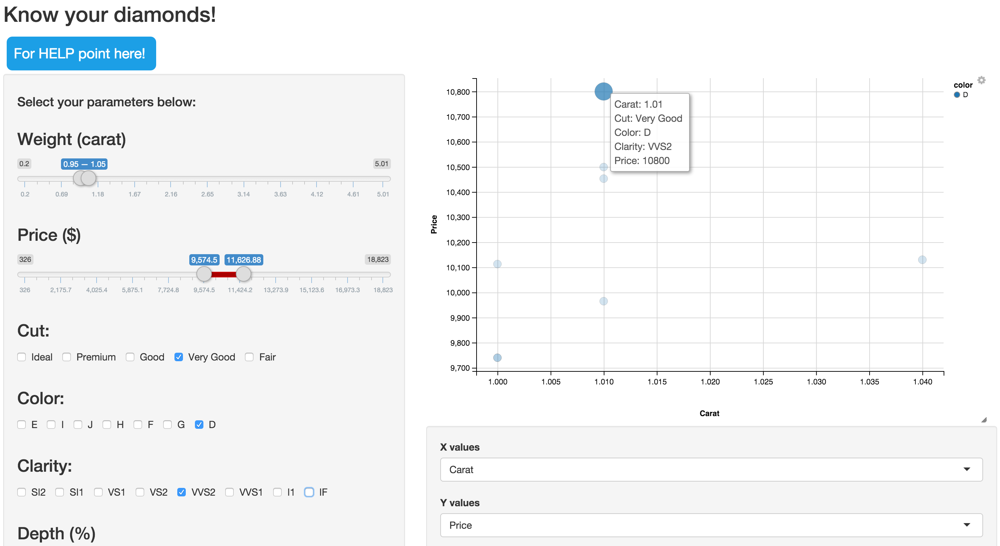
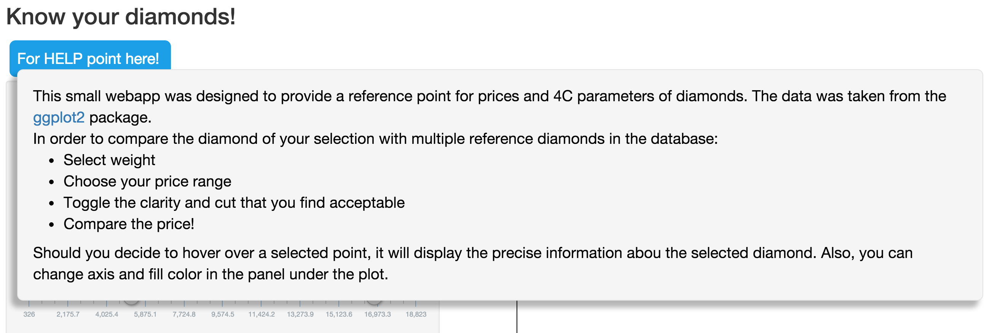
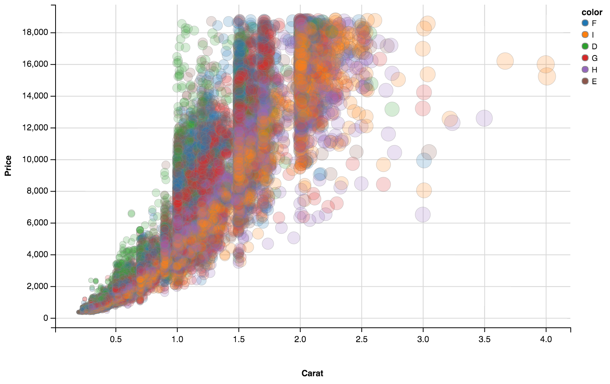

## Ever searched for a   **diamond ring**?

---

## Actually... Forget the *ring* !
*(the setting I mean...)*

---

## Ever searched for a   **diamond**? 😃

---

If you have, you know how painful this process may be.  
The main question is:  
**"How does one choose a diamond  
and  
end up buying a good one?"**

---

The usual [Wikipedia](https://en.wikipedia.org/wiki/Diamond) trick does not help much.

---

Fortunately, there is a bunch of  
**really good information pages**  
out there:  

    <a href="https://www.diamonds.pro">
        </img>
    </a>

    <a href="http://www.4cs.gia.edu/EN-US/index.htm">
        </img>
    </a>

    <a href="https://www.gemsociety.org/article/choosing-a-diamond/">
        </img>
    </a>

---

However, these sources have limited information on the  
**PRICE**  
for a given diamond with known 4C.  

---

Dozens of online stores allow to slice their databases to compare sets of diamonds and prices.  

---

Nevertheless, such a search should be implemented in a much more clean and simple way!

---

The data from [ggplot2](https://cran.r-project.org/web/packages/ggplot2/index.html) might help through the  
[Diamond Hunter](https://www.shinyapps.io/admin/#/application/75469)  
web app.

---

Suppose we have chosen a diamond:

<table class="comparison">
    <tr>
        <td>SHAPE</td>
        <td>CARAT WEIGHT</td>
        <td>COLOR</td>
        <td>CLARITY</td>
        <td>CUT</td>
        <td>PRICE</td>
    </tr>
    <tr>
        <td>ROUND</td>
        <td>1.00</td>
        <td>D</td>
        <td>VVS2</td>
        <td>VERY GOOD</td>
        <td>$10,820</td>
    </tr>
</table>

data taken from jamesallen.com on 12.26.2015

Looks like an exceptional diamond!  
But how does it compare to others?

---

Let's go to [Diamond Hunter](https://www.shinyapps.io/admin/#/application/75469) web app and see...

---

Here we select the parameters in the leftmost panel..

</img>

Point to a diamond and see its specifications!  
Apparently the closest one costs $10,800

---
We have 7 diamonds and ours is the most expensive.  
Have we chosen the one that is a bit overpriced 😕?  
But wait...

---

Recall that an excellent round diamond must have a  
**table between 58% and 60%**  
and a  
**depth between 60% and 62%**  

<a href="http://smartcarat.com/diamond-smarts/diamond-depth-percentage/">
</img>
</a>

which brings us to the research of these parameters!

---

The **chosen diamond**  
has a **table of 59% and a depth 60.5%**.  
This one is truly excellent! Let's refine the search at the bottom of the parameters panel:

</img>

Aa-and we could not find a reference diamond to match 😅, which means the others' fine parameters we slightly worse...

---

`...`and the **price bump for our diamond seems fair enough**.

---

If you forget, there is a help drop-down on the app page. Just point to the help field!

</img>

---

And don't hesitate to investigate. The diamond pricing *(as a function of diamonds' parameters)* is a cool thing!

</img>

---

## Tanks for watching!

---
